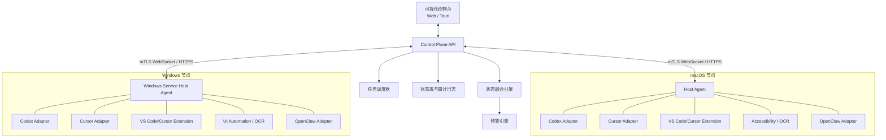

# AitoolMgr：AI 编程工具与 OpenClaw Agent 监控指挥中心

> 文档状态：规划稿 v1.0  
> 更新时间：2026-08-15  
> 目标读者：产品负责人、架构师，以及使用 Codex / Claude Code 实现本项目的开发者

## 1. 项目结论

AitoolMgr 可以实现，并适合采用“中心控制台 + 每台电脑一个 Host Agent + 每种工具一个 Adapter”的架构。

系统需要完成四件事：

1. **看见**：哪些电脑、IDE、AI 编程工具和 OpenClaw Agent 在线。
2. **判断**：它们正在思考、执行、等待审批、等待输入、失败、卡住还是空闲。
3. **提醒**：只在真正需要用户处理时发送告警。
4. **指挥**：从统一控制台启动、继续、取消任务，以及处理审批。

首版推荐支持：

- macOS 与 Windows 节点；
- Codex；
- Cursor CLI 与 Cursor IDE 基础监控；
- VS Code；
- OpenClaw Gateway 及其多个 Agent；
- 数字办公室可视化；
- 局域网多机状态与告警；
- 受控任务的统一下发。

核心原则：**有正式事件就确认状态，没有正式事件就显示“推断状态 + 置信度”，证据不足就显示 `UNKNOWN`，绝不伪造精确状态。**

## 2. 产品目标与非目标

### 2.1 产品目标

- 一个界面看到所有机器和工具的实时状态；
- 每个 OpenClaw Agent 作为独立对象展示，而不是只显示一个 OpenClaw 进程；
- 用户能快速知道“谁需要我处理”；
- 受控任务拥有完整生命周期：创建、执行、审批、完成、失败、取消；
- 工具差异通过 Adapter 隔离；
- 支持局域网内的 macOS、Windows，后续可扩展 Linux；
- 所有远程操作可审计；
- 不默认上传代码、密钥、完整提示词或窗口截图。

### 2.2 首版非目标

- 不承诺读取所有软件的内部思考内容；
- 不通过逆向私有数据库或未公开协议实现核心功能；
- 不默认使用截图和 OCR；
- 不默认自动点击“允许”“批准”按钮；
- 不把 CPU 占用高简单等同于“AI 正在思考”；
- 不让多个 Agent 直接修改同一个工作目录；
- 不将 Gateway、Host Agent 或远程执行端口直接暴露到公网。

## 3. 状态准确性的三个等级

### 3.1 已确认状态

来自官方 API、CLI 结构化输出、Hooks 或 IDE 扩展事件，例如：

- Codex App Server 流式事件；
- Cursor CLI 结构化输出；
- OpenClaw Gateway 事件和 RPC 结果；
- OpenClaw Plugin Hooks；
- VS Code Task、Terminal、Test、Debug API。

界面显示示例：

```text
OpenClaw / researcher · EXECUTING · 已确认
依据：session.tool 事件，runId=...
```

### 3.2 推断状态

来自进程、子进程、窗口文字、日志增长、文件变化、CPU 或终端活动，例如：

```text
Cursor IDE · POSSIBLY_WAITING · 置信度 72%
依据：窗口出现 Allow，Agent 子进程 45 秒无输出
```

### 3.3 未知状态

没有足够证据时必须显示：

```text
UNKNOWN · 工具在线，但当前版本未暴露 Agent 生命周期事件
```

`UNKNOWN` 是正确结果，不是系统错误。

## 4. 总体架构



### 4.1 Control Plane

职责：

- 设备注册、身份和在线状态；
- 接收标准化遥测事件；
- 状态融合；
- 保存任务、告警和审计记录；
- 下发经过授权的任务和控制命令；
- 向前端推送实时变化；
- 管理 Adapter 能力矩阵。

### 4.2 Host Agent

每台电脑运行一个轻量后台服务：

- macOS：LaunchAgent；
- Windows：Windows Service 或受控 Scheduled Task；
- 后续 Linux：systemd service。

职责：

- 发现进程和子进程；
- 采集 CPU、内存、磁盘、网络、运行时间；
- 连接本机 IDE 扩展；
- 连接本机 Codex、Cursor、OpenClaw；
- 可选读取无障碍控件和窗口文字；
- 启动受控任务；
- 在本机执行脱敏；
- 主动连接中心服务并维持心跳。

### 4.3 Adapter SDK

所有工具适配器实现统一接口：

```ts
interface ToolAdapter {
  id: string;
  discover(): Promise<ToolInstance[]>;
  capabilities(instance: ToolInstance): Promise<CapabilitySet>;
  snapshot(instance: ToolInstance): Promise<ToolSnapshot>;
  subscribe(instance: ToolInstance, sink: EventSink): Promise<Disposable>;
  startTask?(request: StartTaskRequest): Promise<TaskHandle>;
  continueTask?(request: ContinueTaskRequest): Promise<void>;
  approve?(request: ApprovalDecision): Promise<void>;
  cancelTask?(taskId: string): Promise<void>;
}
```

能力必须运行时发现，不得因为“某版本理论上支持”就写死：

```json
{
  "monitor": true,
  "streamEvents": true,
  "startTask": true,
  "continueTask": false,
  "approve": true,
  "cancel": true,
  "windowObservation": false
}
```

## 5. 统一状态模型

```text
OFFLINE
IDLE
STARTING
THINKING
EXECUTING
WAITING_APPROVAL
WAITING_INPUT
SUCCEEDED
FAILED
STALLED
UNKNOWN
```

推荐事件结构：

```json
{
  "eventId": "uuid",
  "timestamp": "2026-08-15T12:00:00Z",
  "machineId": "win-dev-02",
  "toolType": "openclaw",
  "toolInstanceId": "gateway-main",
  "agentId": "researcher",
  "sessionId": "session-id",
  "runId": "run-id",
  "taskId": "task-id",
  "state": "EXECUTING",
  "activity": "tool_call",
  "summary": "正在运行测试",
  "needsAttention": false,
  "confidence": 1.0,
  "evidenceSource": "official_event",
  "evidenceType": "session.tool",
  "sensitivity": "metadata_only"
}
```

状态更新规则：

- 正式事件优先于推断事件；
- 新事件必须带来源、时间和置信度；
- 状态必须设置最短持续时间或防抖，避免频繁闪烁；
- 连接断开不能立刻等同于任务失败；
- 事件序列缺口发生时重新拉取快照；
- 推断状态不能覆盖更新的正式状态；
- `WAITING_APPROVAL`、`FAILED` 等需要处理的状态可以立即更新。

## 6. 各工具接入方案

### 6.1 Codex

首选：

- 深度客户端集成：Codex App Server；
- 自动化独立任务：Codex SDK；
- 简单批处理：非交互 CLI。

Codex App Server 可提供认证、会话历史、审批和流式 Agent 事件。优先使用本机 `stdio` JSONL；官方文档将远程 WebSocket 标记为实验能力，因此不能把实验 WebSocket 当作首版生产依赖。参考：[Codex App Server](https://developers.openai.com/codex/app-server)。

Codex 状态映射必须以实际收到的协议事件为准。实现前要记录：

- 本机 Codex 版本；
- `codex app-server --help` 输出摘要；
- 实际事件样本；
- 支持的审批、取消、继续能力；
- 未支持能力。

### 6.2 Cursor

分三种接入：

1. **Cursor CLI 受控任务**：由 Host Agent 启动，解析结构化输出、退出码和会话标识；
2. **Cursor Background Agents**：通过官方 API 管理远程 Agent；
3. **Cursor 前台 IDE**：VS Code 兼容扩展、Hooks、进程和窗口观察组合。

Cursor CLI 支持非交互运行和结构化输出，适合由 AitoolMgr 发起任务。参考：[Cursor CLI](https://docs.cursor.com/en/cli/overview)。

限制：如果 Cursor 前台 IDE 没有暴露某个审批或思考事件，必须显示推断状态或 `UNKNOWN`，不得用私有数据库解析冒充正式支持。

### 6.3 VS Code

开发一个 TypeScript 扩展，采集：

- 工作区；
- Git 仓库和分支；
- Task 开始与结束；
- Terminal 打开、关闭及可获得的命令状态；
- Test、Debug 状态；
- 文件保存和活动时间。

VS Code 有正式 Extension API，但扩展不能任意读取整个 Workbench DOM。参考：[VS Code Extension API](https://code.visualstudio.com/api/) 与 [VS Code API](https://code.visualstudio.com/api/references/vscode-api)。

### 6.4 OpenClaw Agent

OpenClaw 是本项目中可以进行深度监控的对象。它的 Gateway 为外部应用提供 WebSocket + RPC，可启动 Agent、流式接收事件、等待结果、取消任务、查看资源和处理审批。参考：[OpenClaw Gateway external apps](https://docs.openclaw.ai/gateway/external-apps)。

#### 6.4.1 对象模型

```text
Machine
└── OpenClaw Gateway
    ├── Agent: main
    ├── Agent: researcher
    ├── Agent: coder
    ├── Session / Run
    ├── Cron Job
    └── Channel origin: Slack / Telegram / Feishu / ...
```

数字办公室中：

- Gateway 是一间办公室；
- 每个 Agent 是一个独立工位；
- Session/Run 是 Agent 当前桌面上的任务；
- Cron Job 用时钟标识；
- 渠道来源只显示安全类别，不默认展示发送者和消息正文；
- 子 Agent 可显示为临时工位或从属工位。

#### 6.4.2 首选接入链路

```text
OpenClaw Gateway
  ↓ WebSocket/RPC + events
本机 OpenClaw Adapter
  ↓ 标准化、过滤、脱敏
Host Agent
  ↓ mTLS
Control Plane
```

不要把 OpenClaw 默认端口直接暴露给局域网或公网。Host Agent 优先连接本机 loopback Gateway，再向中心转发标准化事件。

Gateway 接入步骤：

1. 发现 Gateway 和版本；
2. 完成 `connect`、认证和协议版本检查；
3. 读取 `hello-ok` 中的 snapshot、methods 和 events；
4. 只订阅当前客户端理解的事件；
5. 使用 `agent` RPC 启动任务，使用 `agent.wait` 等待终态；
6. 使用 `sessions.*` 获取持久会话状态；
7. 处理 `agent`、`session.tool`、`session.approval`、`presence`、`health`、`heartbeat`、`shutdown` 等已发现事件；
8. 发生事件序列缺口时重新请求 health/presence/session 快照；
9. 固定并记录已测试的 OpenClaw 版本，升级时重新跑契约测试。

OpenClaw 文档明确说明事件不负责重放，因此必须实现断线重连后的快照恢复，而不是假设消息不会丢失。参考：[OpenClaw Gateway runbook](https://docs.openclaw.ai/gateway)。

#### 6.4.3 OpenClaw Plugin Hooks

可选开发 `aitoolmgr-observer` 插件，只上报经过脱敏的生命周期元数据：

- `model_call_started`：模型调用开始；
- `model_call_ended`：模型调用结束、耗时和结果；
- `before_tool_call`：工具准备执行；
- `after_tool_call`：工具执行结果；
- `agent_end`：Agent 本轮结束；
- Gateway 和 Session 生命周期事件；
- 审批与阻断的安全类别。

OpenClaw 官方建议将观测使用的数据限制为已清洗字段，例如 runId、callId、provider、model、duration、outcome，避免把原始提示词、历史、响应、请求头或凭证送入遥测。参考：[OpenClaw Plugin Hooks](https://github.com/openclaw/openclaw/blob/main/docs/plugins/hooks.md)。

Plugin 不是唯一数据源：

- Gateway RPC/事件负责外部控制和主要状态；
- Plugin Hooks 补充细粒度模型和工具生命周期；
- CLI `gateway status --json`、health、日志只作为诊断与回退。

#### 6.4.4 OpenClaw 状态映射

| OpenClaw 信号 | AitoolMgr 状态 | 可信度 |
|---|---|---:|
| Gateway 无法连接且进程不存在 | `OFFLINE` | 高 |
| Gateway health 正常且没有活动 Run | `IDLE` | 高 |
| `agent` 请求收到 accepted | `STARTING` | 高 |
| `model_call_started` 且尚无工具调用 | `THINKING` | 高 |
| `session.tool` / `before_tool_call` | `EXECUTING` | 高 |
| `session.approval` | `WAITING_APPROVAL` | 高 |
| Agent 明确结束并要求用户回答 | `WAITING_INPUT` | 中高，需证据 |
| `agent.wait` 返回 ok / `agent_end` success | `SUCCEEDED` | 高 |
| RPC error / `agent_end` failure | `FAILED` | 高 |
| Gateway 有心跳、Run 存在但超过阈值无进展 | `STALLED` | 推断 |
| 版本不兼容或事件无法识别 | `UNKNOWN` | 正确回退 |

不能仅根据“Agent 最后一句像问题”就判断 `WAITING_INPUT`。首版可以要求受控任务使用显式任务协议，或将其标为中等置信度。

## 7. 窗口信息与 OCR

读取顺序：

1. 官方事件；
2. CLI 结构化输出；
3. IDE 扩展和 Hooks；
4. 系统无障碍接口；
5. 指定窗口 OCR；
6. 进程和行为推断。

### 7.1 macOS

使用 AXUIElement/Accessibility API 读取经授权应用的窗口标题、文本控件、按钮和对话框。参考：[Apple AXUIElement](https://developer.apple.com/documentation/applicationservices/axuielement)。

### 7.2 Windows

使用 Microsoft UI Automation 读取窗口和可访问控件树。参考：[Microsoft UI Automation](https://learn.microsoft.com/en-us/windows/win32/winauto/entry-uiautocore-overview)。

### 7.3 OCR 限制

- 默认关闭；
- 用户按应用授权；
- 只截指定窗口或区域；
- 尽量本机 OCR；
- 默认不存图；
- 永久排除密码管理器、密钥工具和用户指定应用；
- OCR 结果永远属于推断证据；
- 首版不自动点击批准按钮。

## 8. 数字办公室可视化

### 8.1 视觉语言

| 实际状态 | 数字办公室表现 |
|---|---|
| `IDLE` | 工位屏幕熄灭，角色休息或玩游戏 |
| `THINKING` | 屏幕亮起，角色思考，显示轻微思考动画 |
| `EXECUTING` | 屏幕亮起，角色打字或运行工具 |
| `WAITING_APPROVAL` | 黄屏，角色举手，出现待处理标识 |
| `WAITING_INPUT` | 蓝/黄提示屏，角色等待对话 |
| `FAILED` | 红屏，出现故障标识 |
| `STALLED` | 屏幕仍亮但动画停止，显示超时计时 |
| `OFFLINE` | 工位灰化，设备断开 |
| `UNKNOWN` | 问号屏幕，展示缺失的证据来源 |

注意：“屏幕亮/黑”是数字办公室中的状态隐喻，不代表真实显示器必须点亮或关闭。

### 8.2 层级

```text
总览
├── 地点/局域网
│   ├── MacBook-Pro
│   │   ├── Codex 工位
│   │   ├── Cursor 工位
│   │   └── VS Code 工位
│   └── Windows-02
│       ├── Cursor 工位
│       └── OpenClaw 办公室
│           ├── main Agent 工位
│           ├── researcher Agent 工位
│           └── coder Agent 工位
└── 待处理中心
```

### 8.3 工位详情

点击一个工位展示：

- 工具、机器、Agent；
- 当前项目与 Git 分支；
- 当前任务摘要；
- 当前状态和持续时间；
- 是否需要处理；
- 状态证据和置信度；
- 最近的工具调用类别；
- 打开工具、查看任务、继续、取消；
- 审批操作必须进入单独详情页，显示完整风险上下文。

### 8.4 筛选

- 全部；
- 忙碌；
- 需要处理；
- 空闲；
- 异常；
- 按机器；
- 按工具；
- 按 OpenClaw Agent。

## 9. 统一任务指挥

标准任务请求：

```json
{
  "machineId": "windows-02",
  "adapter": "openclaw",
  "agentId": "coder",
  "workspace": "D:\\projects\\payment",
  "task": "修复支付模块失败测试",
  "mode": "implement",
  "approvalPolicy": "ask-dangerous",
  "timeoutMinutes": 45
}
```

执行流程：

1. 检查机器和 Adapter 能力；
2. 检查目录白名单；
3. 检查同一仓库是否被其他任务占用；
4. 创建独立 Git branch/worktree；
5. 启动任务；
6. 接收结构化事件；
7. 更新状态和数字办公室动画；
8. 需要审批时创建待处理项；
9. 完成后运行验证；
10. 展示 diff、测试和风险；
11. 用户决定继续、合并或放弃。

不同 Adapter 不一定支持所有操作。UI 必须根据 `CapabilitySet` 隐藏或禁用不支持的按钮。

## 10. 告警设计

首版告警：

- 等待审批超过 30 秒；
- Agent 明确等待输入；
- 任务失败；
- 测试或构建失败；
- 任务超过阈值没有进展；
- Git 冲突；
- 多任务争用同一工作区；
- Host Agent、OpenClaw Gateway 或机器离线；
- 磁盘空间不足；
- 任务成功，等待审查；
- 协议版本或 Adapter 能力发生变化。

每条告警必须包含：

- 严重级别；
- 对象；
- 时间；
- 发生了什么；
- 判断依据；
- 用户可执行的安全操作；
- 自动恢复后关闭告警的条件。

告警必须去重和抑制，避免同一个故障每几秒发送一次。

## 11. 局域网与 Windows

推荐网络模型：

```text
Windows/macOS Host Agent
    └── 主动建立 mTLS WebSocket
          └── Control Plane
```

- Agent 主动连中心，中心不扫描和远程登录电脑；
- 局域网发现可用 mDNS，但发现不等于信任；
- 每台设备独立注册和撤销；
- 跨网络使用 Tailscale、WireGuard 或企业 VPN；
- OpenClaw Gateway 默认保持 loopback；
- Windows 使用 Named Pipe 与本机扩展通信；
- macOS 使用 Unix Domain Socket；
- 凭证保存在本机安全存储：macOS Keychain / Windows DPAPI；
- 断线后使用快照恢复，而不是假设事件完整。

## 12. 安全与隐私

### 12.1 权限等级

| 权限 | 能力 |
|---|---|
| 观察 | 进程、状态、资源，不读取内容 |
| 内容读取 | 终端、已授权窗口文字、脱敏日志 |
| 普通执行 | 启动白名单任务 |
| 代码修改 | 修改白名单仓库，必须使用隔离工作区 |
| 高风险操作 | 删除、发布、推送、管理员权限，必须单独审批 |

### 12.2 强制要求

- 设备级身份；
- mTLS 或等效双向认证；
- 项目目录白名单；
- 命令风险分类；
- 高风险操作不可批量自动批准；
- 密钥只存本机；
- 日志、事件和 OCR 本机脱敏；
- 完整审计；
- 一键撤销设备；
- 任务使用独立 worktree；
- 默认不保存提示词正文和模型回复正文；
- OpenClaw 观测插件默认只采集生命周期元数据；
- 原始窗口截图不得作为中心端长期存储。

## 13. 推荐技术栈与代码结构

### 13.1 技术栈

- Web 前端：React + TypeScript；
- 桌面封装：Tauri；
- Control Plane：TypeScript/NestJS 或 Go；
- Host Agent：Go；
- VS Code/Cursor Extension：TypeScript；
- OpenClaw Observer Plugin：TypeScript；
- 实时通信：WebSocket；
- 数据协议：JSON Schema，必要时生成 TypeScript/Go 类型；
- 数据库：开发期 SQLite，稳定后 PostgreSQL；
- 队列：首版数据库队列，规模扩大后 Redis；
- 可观测性：OpenTelemetry；
- 图形：CSS/SVG + ECharts；
- 测试：Vitest/Playwright + Go test + 契约测试。

### 13.2 推荐仓库结构

```text
AitoolMgr/
├── apps/
│   └── control-center/          # React/Tauri UI
├── services/
│   └── control-plane/           # API、状态、调度、告警
├── agents/
│   └── host-agent/              # Go，多平台后台服务
├── adapters/
│   ├── codex/
│   ├── cursor/
│   ├── openclaw/
│   └── generic-process/
├── extensions/
│   └── vscode/                  # VS Code/Cursor 扩展
├── plugins/
│   └── openclaw-observer/       # 可选 OpenClaw 遥测插件
├── packages/
│   ├── contracts/
│   ├── adapter-sdk/
│   └── test-fixtures/
├── docs/
│   ├── adr/
│   ├── research/
│   ├── security/
│   └── runbooks/
└── tests/
    ├── contract/
    └── e2e/
```

## 14. 版本路线与验收

| 阶段 | 交付 | 预计时间 |
|---|---|---:|
| P0 | 接口验证、事件样本、风险清单 | 1 周 |
| P1 | 骨架、协议、模拟器、数字办公室 | 1～2 周 |
| P2 | macOS/Windows Host Agent 与基础进程监控 | 2 周 |
| P3 | VS Code/Cursor 扩展与 Cursor CLI | 2 周 |
| P4 | Codex 深度接入 | 1～2 周 |
| P5 | OpenClaw Gateway、Agent 与 Hooks 接入 | 2 周 |
| P6 | 局域网、安全、告警 | 2～3 周 |
| P7 | 统一指挥、worktree、审批与结果审查 | 2～3 周 |
| P8 | 窗口读取、OCR、安装包、稳定性 | 2～4 周 |

单人开发：

- 可演示原型：约 3 周；
- 可用 MVP：约 6～9 周；
- 稳定多机版本：约 12～16 周。

MVP 验收标准：

- 节点上线后 10 秒内出现；
- 正式事件 3 秒内展示；
- 轮询推断状态 15 秒内刷新；
- 受控 Codex/Cursor/OpenClaw 任务状态准确率超过 95%；
- 审批事件 5 秒内生成待处理项；
- 支持至少 1 台 macOS 和 2 台 Windows；
- OpenClaw 多 Agent 分别展示；
- 断线重连后能恢复快照；
- 未支持能力显示 `UNKNOWN/UNSUPPORTED`；
- 所有控制操作可审计；
- 默认不上传代码正文、密钥和截图。

## 15. 降低模型幻觉的开发方法

不要把整个项目一次性交给模型。每次只执行一个阶段，并在阶段之间做独立验收。

### 15.1 证据矩阵

维护 `docs/research/evidence-matrix.md`：

| 工具 | 版本 | 能力 | 证据 | 样本/测试 | 状态 |
|---|---|---|---|---|---|
| OpenClaw | 实测版本 | `session.approval` | 官方文档 + 实际事件 | fixture 文件 | confirmed |
| Cursor IDE | 实测版本 | 前台审批事件 | 未发现公开接口 | 无 | unsupported |

每个 Adapter 只能实现矩阵中 `confirmed` 的能力。`inferred` 必须在产品中显示置信度；`unsupported` 不能用假实现掩盖。

### 15.2 固定原则

- 先检查本地版本、`--help`、官方文档、公开类型和真实输出，再写集成；
- 不记忆猜测事件名；
- 不猜测 JSON 字段；
- 不将测试 Fixture 当成真实生产接口；
- Adapter 启动时做能力协商；
- 版本升级必须重跑契约测试；
- 每阶段均运行测试并记录命令与结果；
- 未通过验收不能进入下一阶段；
- 可以少实现，但不能假装支持。

## 16. 给 Codex / Claude Code 的分阶段提示词

使用方法：

1. 新建一个 Codex 或 Claude Code 任务；
2. 先粘贴“固定前置提示词”；
3. 再粘贴当前阶段提示词；
4. 阶段完成后，使用“阶段验收提示词”让另一个任务或另一个模型审查；
5. 验收通过后再进入下一阶段。

### 16.1 固定前置提示词（每个阶段都粘贴）

```text
你正在实现 AitoolMgr，一个跨 macOS/Windows 的 AI 编程工具与 OpenClaw Agent 监控指挥中心。

工作规则：
1. 先读取仓库内的 AGENTS.md、CLAUDE.md、README、docs/adr、docs/research/evidence-matrix.md 和现有代码，再决定修改方案。
2. 保留用户已有改动，不删除或覆盖无关内容，不执行破坏性 Git 命令。
3. 不得根据记忆猜测 Codex、Cursor、VS Code 或 OpenClaw 的 API、事件名、字段和命令。优先检查：本机版本与 --help、官方文档、公开类型定义、实际运行输出。把证据写入 docs/research/evidence-matrix.md。
4. 只有被证据确认的能力才能标记为 supported。没有证据时返回 UNKNOWN 或 UNSUPPORTED，并在 UI 显示原因，禁止用假数据冒充真实集成。
5. 不解析未公开的私有数据库或私有协议，不绕过产品认证和权限机制。
6. 正式事件与推断信号必须分开。所有状态事件必须包含 source、confidence、timestamp 和 evidenceType。
7. 默认不采集代码正文、完整提示词、完整模型回复、密钥或屏幕截图。日志必须脱敏。
8. 高风险操作不得自动批准；删除、发布、推送、安装软件、管理员权限必须由用户明确审批。
9. 只完成当前阶段，不提前实现后续阶段。可以做必要接口预留，但不要扩张范围。
10. 使用小而可审查的提交粒度。实现后运行与本阶段相关的格式检查、静态检查、单元测试、契约测试或 E2E。
11. 如果被外部依赖、缺失凭证或未安装工具阻塞，不要伪造成功；完成可离线进行的部分，记录阻塞、复现步骤和需要用户提供的内容。
12. 除非阶段明确要求只做研究，否则不要只给计划：应实现、测试并汇报实际改动。

每次完成时必须输出：
- 本阶段完成项；
- 修改的关键文件；
- 执行的验证命令与结果；
- 新增或变化的能力矩阵；
- 已知限制和下一阶段前置条件。
```

### 16.2 P0：接口调查与可行性验证

```text
当前阶段：P0，只做证据驱动的调查和最小验证，不开发正式产品功能。

目标：确认本机和目标环境中 Codex、Cursor、VS Code、OpenClaw 可用的公开集成面，建立后续实现的事实基础。

任务：
1. 检查仓库结构；若为空，创建 docs/research、docs/adr、spikes 和最小 README。
2. 在不泄露凭证的前提下检查已安装工具的版本和 --help。未安装的工具记录为 unavailable，不要擅自安装。
3. 查阅相应官方文档和公开类型定义，记录 URL、访问日期、工具版本、能力和限制。
4. 为以下能力建立证据矩阵：发现实例、读取状态、订阅事件、启动任务、继续任务、取消任务、处理审批、获取会话、读取 Agent/子 Agent。
5. 在 spikes 中创建可删除的最小验证程序或脚本，捕获经过脱敏的真实事件样本：
   - Codex App Server stdio；
   - Cursor CLI 结构化输出；
   - OpenClaw Gateway connect/hello、health、agent 事件；
   - VS Code Extension API 需要的事件面。
6. 对 OpenClaw 特别验证：协议版本发现、methods/events 能力列表、agent + agent.wait、sessions、session.tool、session.approval、断线后快照恢复。
7. 不知道的字段不得补写。保存 Fixture 时必须标明工具版本，并删除提示词正文、回复正文、路径、Token 和用户身份。
8. 创建 ADR：总体架构、状态可信度模型、为什么远程节点采用主动连接、为什么 OpenClaw Gateway 默认只在本机访问。

验收：
- docs/research/evidence-matrix.md 存在且每条能力有证据或明确标记 unknown/unavailable；
- 至少有 Codex、Cursor、VS Code、OpenClaw 四份研究记录；
- 不存在声称支持但没有证据的事件名或字段；
- 所有验证脚本可安全失败，不包含密钥；
- 本阶段不实现正式 UI 和远程执行。
```

### 16.3 P1：工程骨架、统一协议和数字办公室模拟器

```text
当前阶段：P1。前提是 P0 证据矩阵已经存在；如果不存在或内容不足，停止正式集成，只补齐 P0。

目标：建立可扩展工程骨架、统一状态协议、Adapter SDK 和使用模拟数据的数字办公室 UI。

任务：
1. 建立仓库结构：apps/control-center、services/control-plane、agents/host-agent、adapters、extensions/vscode、plugins/openclaw-observer、packages/contracts、packages/adapter-sdk、tests。
2. 选择并记录包管理、格式化、静态检查和测试方案；不要同时引入多个功能重复的框架。
3. 用 JSON Schema 定义 Machine、ToolInstance、AgentInstance、Task、Approval、CapabilitySet、TelemetryEvent、StateSnapshot、Alert。
4. 从 Schema 生成或共享 TypeScript/Go 类型，避免前后端重复手写并漂移。
5. 实现 Adapter 接口和一个独立 SimulatorAdapter。模拟器必须明确标记 simulated，生产构建默认关闭。
6. 实现状态融合最小版本：正式状态优先、置信度、防抖、UNKNOWN、STALLED 超时。
7. 实现数字办公室 UI：
   - 忙碌：屏幕亮、角色打字；
   - 空闲：屏幕黑、角色休息/玩；
   - 待审批：黄屏、角色举手；
   - 失败：红屏；
   - 离线：灰化；
   - 未知：问号并显示原因。
8. 支持 Machine → Tool/Gateway → OpenClaw Agent 层级，以及全部/忙碌/需处理/空闲/异常筛选。
9. 工位详情展示状态、持续时间、任务摘要、证据来源、置信度和能力按钮。未支持按钮必须隐藏或禁用。
10. 添加状态机、Schema 和主要 UI 交互测试；用 Playwright 检查桌面和窄屏布局。

验收：
- 使用模拟事件可完整演示所有统一状态；
- OpenClaw 一个 Gateway 下可显示多个 Agent 工位；
- UI 明确标识 simulated；
- 320px 宽度无横向溢出，桌面布局无重叠；
- Schema/Adapter/状态机测试通过；
- 没有接入真实工具，也没有把模拟数据写进生产 Adapter。
```

### 16.4 P2：Host Agent 与基础系统监控

```text
当前阶段：P2。只实现 Host Agent、节点连接和通用进程遥测，不实现窗口 OCR 和高风险远程执行。

目标：macOS 与 Windows 节点能安全注册、心跳并上报工具进程和资源状态。

任务：
1. 使用 Go 实现 Host Agent，拆分 darwin/windows 平台层和可测试的公共层。
2. 实现稳定 machineId、Agent 版本、平台信息、启动时间、心跳、断线重连和指数退避。
3. 实现进程发现与进程树跟踪，识别配置中的 Codex、Cursor、VS Code、OpenClaw 进程；进程名必须可配置并有平台测试。
4. 采集 CPU、内存、运行时间和子进程摘要，不采集命令行中的秘密参数；上报前脱敏。
5. 实现本地 Unix Domain Socket / Windows Named Pipe，为 IDE 扩展和 Adapter 提供认证后的本机通信。
6. 实现 Control Plane 节点注册、心跳、在线/离线和快照保存。
7. 当前阶段只允许观察类命令。不要实现任意 shell 执行接口。
8. 提供开发模式配置和服务安装文档，但不要未经用户允许修改系统启动项。

验收：
- macOS 与 Windows 平台代码可构建；
- 至少在当前平台完成真实进程发现测试；
- 断网、中心重启后可自动重连；
- 控制台能看到机器和工具进程在线/离线；
- 命令行参数、环境变量、Token 不进入日志；
- 没有任意远程 shell 能力。
```

### 16.5 P3：VS Code/Cursor IDE 与 Cursor CLI

```text
当前阶段：P3。实现 VS Code/Cursor 扩展和证据矩阵确认的 Cursor CLI 能力。

目标：获得工作区、Task、Terminal、Test、Debug 状态，并能监控由系统启动的 Cursor CLI 任务。

任务：
1. 实现 VS Code 扩展，通过本机认证 IPC 向 Host Agent 上报工作区、Git 分支、Task、Terminal、Test、Debug 和活动时间。
2. 只使用稳定公开 VS Code API；不要读取 Workbench DOM，不要注入 Cursor 私有 UI。
3. 实现 Cursor CLI Adapter，由 Host Agent 管理完整进程生命周期，并只解析当前实测版本确认的结构化输出字段。
4. 为 Cursor CLI 保存脱敏 Fixture 和契约测试。未知事件必须保留原始类别摘要并映射为 UNKNOWN，不得导致 Adapter 崩溃。
5. Cursor 前台 IDE 没有正式事件时，只组合扩展、进程、Hooks 和窗口存在性生成推断状态，并显示置信度。
6. 实现任务退出码、取消、超时和异常终止；是否支持继续会话必须由能力发现决定。
7. UI 展示状态证据，不把“IDE 打开”显示为“Agent 忙碌”。

验收：
- VS Code Task/Terminal/Test/Debug 事件有自动化测试或 Extension Host 测试；
- 受控 Cursor CLI 任务能显示开始、执行、完成/失败；
- Cursor 前台未知状态不会被误报为确定状态；
- 未记录敏感终端正文；
- 所有实现能力能在 evidence-matrix 中找到证据。
```

### 16.6 P4：Codex 深度接入

```text
当前阶段：P4。实现 Codex Adapter，只使用 P0 证据确认的协议和当前官方接口。

目标：受控 Codex 任务能够流式展示状态、审批、完成、失败和取消。

任务：
1. 优先使用本机 Codex App Server stdio JSONL；不要把实验性远程 WebSocket 作为生产必需路径。
2. 实现进程监督、初始化/能力发现、消息关联、断线和异常退出处理。
3. 将真实协议事件映射到统一状态；映射表必须引用实际 Fixture 和 Codex 版本。
4. 实现受控任务启动、流式事件、审批、取消和会话恢复中被证据确认的部分。
5. 如果自动化作业更适合 Codex SDK，建立独立执行路径，不把 SDK 和 App Server 的事件字段混用。
6. 未知协议消息记录安全摘要并进入 UNKNOWN/diagnostic，不得猜测其意义。
7. 添加协议契约测试、状态映射测试、App Server 崩溃与重启测试。
8. 文档说明正式支持路径、实验路径和当前限制。

验收：
- 受控 Codex 任务状态准确、可追踪；
- 审批请求能进入待处理中心；
- 用户拒绝或取消后状态正确；
- App Server 异常不会导致 Host Agent 崩溃；
- 不依赖未确认字段；
- UI 能显示证据来源与 Codex 实例版本。
```

### 16.7 P5：OpenClaw Gateway 与多 Agent 监控

```text
当前阶段：P5。实现 OpenClaw Adapter 和可选的 aitoolmgr-observer Plugin。

目标：一个 OpenClaw Gateway 下的多个 Agent 能独立监控、显示和接受受控任务。

任务：
1. Host Agent 连接本机 OpenClaw Gateway loopback。实现 connect、认证、协议版本检查、hello-ok snapshot 和 methods/events 能力发现。
2. 固定已测试的 OpenClaw 版本。把真实脱敏协议样本保存为 Fixture，并为每次升级提供契约测试。
3. 实现 Gateway health、presence、heartbeat、shutdown 和断线重连。
4. 发现 Agent、Session、Run，并将每个 Agent 映射为独立数字办公室工位。
5. 对受控任务使用官方文档确认的 agent RPC 与 agent.wait。会话使用 sessions.*；取消和审批只在 capability 确认后启用。
6. 订阅并处理已发现的 agent、session.tool、session.approval 等事件。不要硬编码 hello-ok 未声明且 evidence-matrix 未确认的事件。
7. 事件不重放：检测序列缺口或重连后，重新获取 health、presence、session/task 快照，再继续增量事件。
8. 开发可选 OpenClaw Plugin，只上报最小元数据。优先使用 model_call_started/model_call_ended、before_tool_call/after_tool_call、agent_end 等被当前版本公开类型确认的 Hooks。
9. Plugin 不得上报原始提示词、历史、模型回复、请求头、提供商请求 ID 或密钥。使用 runId、callId、provider、model、duration、outcome 等安全字段。
10. 将 Cron/Channel 来源作为可选标签；默认不展示发送者身份和消息正文。
11. 实现 Gateway 不可用、认证失败、版本不兼容、未知事件和 Plugin 未安装等降级路径。

验收：
- 一个 Gateway 下至少 3 个模拟或真实 Agent 可独立显示；
- Agent 的 STARTING/THINKING/EXECUTING/WAITING_APPROVAL/SUCCEEDED/FAILED 映射有契约测试；
- 重连和事件缺口后状态能通过快照恢复；
- Plugin 未安装时 Gateway 基础监控仍可工作；
- Gateway 保持 loopback，不在本阶段直接暴露公网；
- 遥测中没有提示词正文、回复正文和凭证。
```

### 16.8 P6：局域网、安全注册与告警

```text
当前阶段：P6。实现多机安全连接、设备管理和告警，不增加新的工具 Adapter。

目标：macOS/Windows 节点可在局域网可靠运行，告警可用且不过度打扰。

任务：
1. 实现一次性设备注册、设备证书、mTLS、证书轮换和设备撤销。
2. Host Agent 必须主动连接 Control Plane；不要实现中心扫描、共享管理员账号或裸远程 shell。
3. 实现连接保活、指数退避、时钟偏差容忍、离线判定和快照恢复。
4. 密钥使用 macOS Keychain / Windows DPAPI 或经过 ADR 评审的等效安全存储。
5. 实现目录白名单、操作权限、速率限制、日志脱敏和审计日志。
6. 实现告警规则：等待审批、等待输入、失败、卡住、离线、测试失败、Git 冲突、磁盘不足、版本不兼容。
7. 实现告警去重、冷却、恢复通知和静默时间。
8. 外部通知先实现通用 Webhook；具体企业微信/飞书/Slack Adapter 后续扩展。
9. 增加威胁模型和安全测试，覆盖伪造节点、重放、失效证书、恶意日志字段和超大事件。

验收：
- 未注册节点不能连接；
- 撤销后节点无法继续发送或接收命令；
- 网络抖动不会制造大量重复节点或告警；
- 敏感字段脱敏测试通过；
- 同一故障不会持续重复通知；
- OpenClaw Gateway 不需要直接暴露给中心。
```

### 16.9 P7：统一任务调度、worktree 与审批

```text
当前阶段：P7。实现统一任务下发和安全生命周期控制。

目标：用户能选择机器、工具/OpenClaw Agent、仓库和任务，并安全地完成执行、审批、取消和结果审查。

任务：
1. 实现 Task API、任务队列、幂等键、租约、超时、取消和终态。
2. 调度前检查节点在线、Adapter capability、目录白名单、磁盘空间和仓库占用。
3. 默认为代码任务创建独立 Git worktree/branch；禁止两个写任务共享同一工作目录。
4. 通过 Adapter 能力调用 start/continue/approve/cancel。未支持的操作必须在 UI 禁用并说明原因。
5. 实现审批详情页，显示工具、机器、Agent、命令类别、工作目录、风险、超时和批准/拒绝。不得只提供一个无上下文的“允许”按钮。
6. 高风险操作不能批量批准，不能通过 OCR 自动点击。
7. 完成后展示 diff 摘要、测试结果、未提交文件和风险。不要自动合并、推送或发布。
8. 所有操作写入不可抵赖的审计事件，并包含操作者、对象、时间和结果。
9. 添加幂等、并发争用、取消竞态、节点断线和审批超时测试。

验收：
- Codex、Cursor CLI、OpenClaw 至少各有一条受控任务 E2E 或可复现的受控集成测试；
- 重复提交不会创建重复任务；
- 同一仓库的写任务不会共享工作目录；
- 未授权操作被拒绝并记录；
- 用户可以安全取消和拒绝审批；
- 系统不自动推送或发布。
```

### 16.10 P8：窗口读取、OCR、稳定性和发布

```text
当前阶段：P8。实现可选窗口观察、OCR 回退、安装包和生产稳定性。

目标：在正式事件不足时提供透明的推断能力，并交付可安装的 macOS/Windows 版本。

任务：
1. macOS 使用官方 Accessibility/AXUIElement；Windows 使用 UI Automation。先读取窗口标题和结构化控件，再考虑 OCR。
2. 权限必须按功能明确申请，拒绝授权后系统仍能运行基础监控。
3. OCR 默认关闭，只允许指定应用和指定窗口；本机处理，默认不保存图片。
4. 为密码框、密钥工具、用户黑名单应用实现硬性排除。
5. 窗口/OCR 结果只能产生 inferred 状态，包含 confidence 和证据，不得覆盖更新的正式事件。
6. 不实现自动点击高风险审批。普通“打开工具”也要经过能力与权限检查。
7. 完成 Tauri 控制台、macOS 安装包、Windows MSI/安装包和 Host Agent 服务安装/卸载。
8. 完成升级、回滚、配置迁移、数据库备份和故障恢复 Runbook。
9. 运行长时间稳定性、断网、睡眠唤醒、多显示器、高 DPI、深浅主题和无障碍测试。
10. 完成安全检查，确认生产包不含模拟 Adapter、测试 Token、Fixture 敏感数据或调试后门。

验收：
- 拒绝屏幕/辅助功能权限不影响官方事件监控；
- OCR 关闭时无任何截图行为；
- 推断状态始终标注置信度；
- 安装、升级、卸载流程可复现；
- macOS 与 Windows 数字办公室布局正常；
- 生产包通过安全和隐私检查。
```

### 16.11 阶段验收提示词（建议交给另一个模型）

```text
你是 AitoolMgr 当前阶段的独立验收人员。不要继续开发下一阶段，也不要相信已有总结；以代码、Git diff、测试结果、官方文档和 docs/research/evidence-matrix.md 为证据。

任务：
1. 读取当前阶段提示词和验收标准。
2. 检查改动是否超出范围，是否覆盖用户已有工作，是否引入破坏性或隐藏行为。
3. 对所有 Codex、Cursor、VS Code、OpenClaw API/事件/字段声明逐项寻找证据。无证据的标为 hallucinated-or-unverified。
4. 检查模拟数据是否可能进入生产路径，UNKNOWN/UNSUPPORTED 是否被错误显示为成功。
5. 检查正式状态与推断状态是否分离，source/confidence/evidenceType 是否完整。
6. 检查隐私：提示词、模型回复、代码、环境变量、命令行 Token、窗口截图是否可能泄露。
7. 运行本阶段相关格式、静态检查、单元、契约和 E2E；记录实际命令和结果。
8. 检查错误路径：工具未安装、版本不兼容、认证失败、断线、事件缺口、未知事件、取消竞态。
9. 输出按严重度排序的问题清单，给出文件和行号。没有问题时明确写“未发现阻塞问题”，不要编造问题。
10. 最后只给出 PASS 或 FAIL。只有所有本阶段验收标准都有证据且没有阻塞问题时才能 PASS。

除非修复是极小且明确的测试/文档错误，否则本轮只审查，不修改代码。
```

### 16.12 中断后续做提示词

```text
继续 AitoolMgr 项目，但不要根据之前聊天摘要直接动手。

先执行：
1. 读取 AGENTS.md、CLAUDE.md、README、本总体方案、docs/adr、docs/research/evidence-matrix.md。
2. 检查 git status、最近改动和当前测试状态。
3. 判断已经完成到 P0-P8 的哪一阶段，并用文件和测试证据说明。
4. 找出最近一个未通过验收的阶段，只继续该阶段；不要跳到后续阶段。
5. 复用现有架构和类型，不重复搭建，不覆盖用户改动。

然后按照该阶段原提示词完成剩余工作、运行验证，并按固定前置提示词要求汇报。
```

## 17. 主要风险

| 风险 | 影响 | 应对 |
|---|---|---|
| 工具升级改变事件协议 | Adapter 失效 | 版本固定、能力发现、Fixture 契约测试 |
| Cursor 前台状态不开放 | 状态不精确 | 明确推断状态，不承诺完整接管 |
| 窗口无障碍树不完整 | 读不到信息 | OCR 可选回退，仍显示置信度 |
| OCR 泄露敏感内容 | 高 | 默认关闭、本机处理、应用排除 |
| 远程控制权限过大 | 高 | mTLS、白名单、审批、审计、无裸 shell |
| 多 Agent 修改同仓库 | 代码冲突 | worktree、仓库租约、写任务互斥 |
| OpenClaw 事件不重放 | 状态漂移 | 序列检测、重连后快照恢复 |
| 模型在实现时虚构 API | 高 | P0、证据矩阵、分阶段提示词、独立验收 |

## 18. 参考资料

- [OpenAI Codex App Server](https://developers.openai.com/codex/app-server)
- [OpenAI model prompting guidance](https://developers.openai.com/api/docs/guides/latest-model)
- [VS Code Extension API](https://code.visualstudio.com/api/)
- [VS Code API Reference](https://code.visualstudio.com/api/references/vscode-api)
- [Cursor CLI](https://docs.cursor.com/en/cli/overview)
- [Cursor Background Agents API](https://docs.cursor.com/background-agent/api/overview)
- [OpenClaw Gateway external apps](https://docs.openclaw.ai/gateway/external-apps)
- [OpenClaw Gateway runbook](https://docs.openclaw.ai/gateway)
- [OpenClaw Internal Hooks](https://github.com/openclaw/openclaw/blob/main/docs/automation/hooks.md)
- [OpenClaw Plugin Hooks](https://github.com/openclaw/openclaw/blob/main/docs/plugins/hooks.md)
- [Apple AXUIElement](https://developer.apple.com/documentation/applicationservices/axuielement)
- [Microsoft UI Automation Fundamentals](https://learn.microsoft.com/en-us/windows/win32/winauto/entry-uiautocore-overview)

